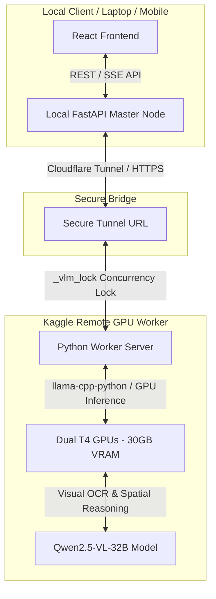
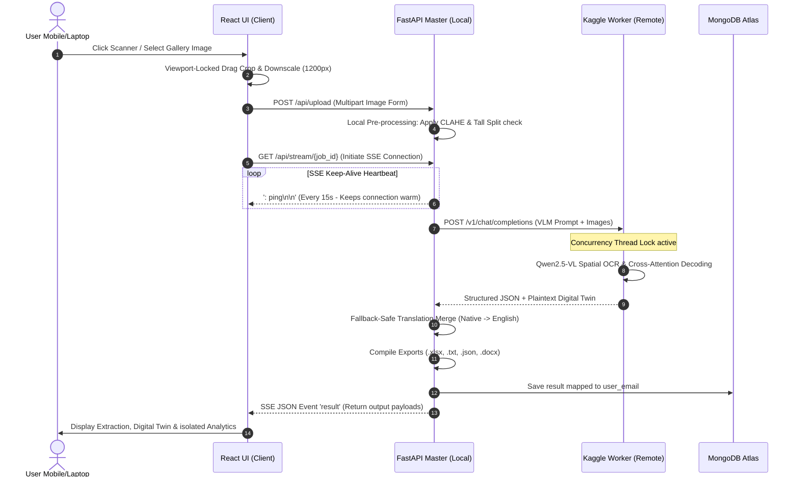

# 🌊 Project Execution Flow & Module Architecture

This document provides a comprehensive, clear-cut explanation of how the **Multimodal Document Intelligence System** processes an invoice or receipt, from the moment a user captures an image on their phone to the generation of exports and dashboard analytics.

---

## 🏗️ Master-Worker Distributed Infrastructure

To run a state-of-the-art **32-Billion parameter Vision-Language Model (Qwen2.5-VL-32B)** without requiring enterprise-grade local servers, the project implements a **Master-Worker split-node architecture**:

---

## 🚀 End-to-End Pipeline Execution Flow

Here is the exact step-by-step path an invoice travels through the system:

---

## 🔍 Module-by-Module Breakdown

### 1. User Capture & Viewport-Locked Cropper (Frontend)
*   **File References:**
    *   [CaptureScreen.jsx](file:///e:/Desktop/Antigravity/Final%20Sem%20Project%20Anti/Updated%20Final%20Year%20Project/frontend/src/components/CaptureScreen.jsx)
    *   [UploadZone.jsx](file:///e:/Desktop/Antigravity/Final%20Sem%20Project%20Anti/Updated%20Final%20Year%20Project/frontend/src/components/UploadZone.jsx)
*   **How it works:**
    *   **In-App Scanner:** Streams live video feed inside an overlay using `navigator.mediaDevices.getUserMedia`. Captured frames are rendered into an offscreen HTML canvas. This method prevents mobile browsers from crashing due to native camera apps exhausting device RAM.
    *   **Locked Touch Cropping:** Uses `touch-action: none` styling to disable mobile screen scrolling while dragging crop boundaries. 
    *   **Memory Optimization:** Downscales cropped images to a maximum boundary of `1200px` to keep GPU VRAM consumption low and prevent Remote Node memory crashes.

### 2. Contrast Enhancement & Tall Splitting (Local Backend)
*   **File Reference:**
    *   [image_enhancer.py](file:///e:/Desktop/Antigravity/Final%20Sem%20Project%20Anti/Updated%20Final%20Year%20Project/backend/utils/image_enhancer.py)
*   **How it works:**
    *   **CLAHE Enhancement:** Operates on small image tiles to dynamically maximize contrast without blowing out shadows or highlights. Essential for faded ink on supermarket thermal receipts.
    *   **Split Tall Receipts:** Analyzes the aspect ratio. If the image height is excessively tall, it splits the document into segments with overlapping margins so they fit within the VLM token budget.

### 3. Tunneling & SSE Heartbeat Loop (Bridge)
*   **File References:**
    *   [main.py](file:///e:/Desktop/Antigravity/Final%20Sem%20Project%20Anti/Updated%20Final%20Year%20Project/backend/main.py)
    *   [gguf_engine.py](file:///e:/Desktop/Antigravity/Final%20Sem%20Project%20Anti/Updated%20Final%20Year%20Project/backend/vlm/gguf_engine.py)
*   **How it works:**
    *   **Heartbeat Loop:** Cloudflare Tunnels terminate idle requests after 100 seconds. Because processing high-resolution images on remote T4 GPUs can take 20–40 seconds, the Master Node periodically writes SSE comment heartbeats (`: ping\n\n`) to keep the tunnel socket active.

### 4. Remote Multimodal Visual OCR (Kaggle GPU Node)
*   **File Reference:**
    *   [vlm_model.py](file:///e:/Desktop/Antigravity/Final%20Sem%20Project%20Anti/Updated%20Final%20Year%20Project/backend/vlm/vlm_model.py)
*   **How it works:**
    *   **Native Spatial Vision OCR:** The Qwen2.5-VL model does not use bounding box detectors. It directly applies self-attention matrices on localized image patches to infer relationships (e.g. matching item descriptions to values).
    *   **Dual-Script Prompting:** Prompts the VLM to output two blocks: a native script block (e.g. Tamil or Hindi) and a fully translated English block. It also instructs the model to construct a `Digital Twin` (a Notepad-style plaintext grid recreating the spacing, columns, and rows of the original invoice).

### 5. Translation Merge & Export Formatting (Local Backend)
*   **File References:**
    *   [layout_template.py](file:///e:/Desktop/Antigravity/Final%20Sem%20Project%20Anti/Updated%20Final%20Year%20Project/backend/utils/layout_template.py)
    *   [export.py](file:///e:/Desktop/Antigravity/Final%20Sem%20Project%20Anti/Updated%20Final%20Year%20Project/backend/utils/export.py)
    *   [report_generator.py](file:///e:/Desktop/Antigravity/Final%20Sem%20Project%20Anti/Updated%20Final%20Year%20Project/backend/utils/report_generator.py)
*   **How it works:**
    *   **Fallback-Safe Merge:** Iterates through the translated English JSON key-by-key. If a key is missing or empty, it retains the native-language value to prevent data loss.
    *   **Automatic Export compilation:** Compiles the data structures into structured `.xlsx` tables, plaintext `.txt` reports, and `.docx` word files.

### 6. Mapped MongoDB History & Isolated Analytics Dashboard (Database & UI)
*   **File References:**
    *   [repository.py](file:///e:/Desktop/Antigravity/Final%20Sem%20Project%20Anti/Updated%20Final%20Year%20Project/backend/db/repository.py)
    *   [auth_repository.py](file:///e:/Desktop/Antigravity/Final%20Sem%20Project%20Anti/Updated%20Final%20Year%20Project/backend/db/auth_repository.py)
    *   [Dashboard.jsx](file:///e:/Desktop/Antigravity/Final%20Sem%20Project%20Anti/Updated%20Final%20Year%20Project/frontend/src/components/Dashboard.jsx)
*   **How it works:**
    *   **User Isolation:** Database read/write queries verify the logged-in user's email signature from the request JWT token. Guest uploads are saved under a temporary guest ID and deleted from the view on session exit.
    *   **Regex Searching:** Queries Mongo using case-insensitive regex flags (`$options: "i"`) to find keywords across filenames, languages, or vendors.
    *   **Analytics Engine:** Aggregates database history on the client-side to render responsive, interactive SVG charts (spending trends, vendor shares, and currency charts) without external package overhead.
