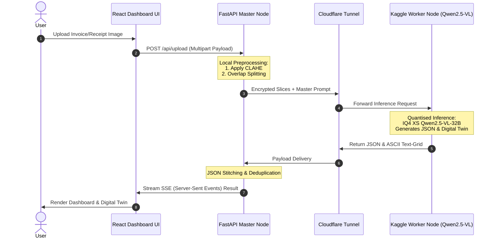

# Project Report Alignment & Formatting Master Plan
## For Multimodal Document Intelligence System (MDIS)

This guide provides a comprehensive, step-by-step plan to transition your project report (`project report Copy.docx`) from the **old project concept** (which relied on LayoutLMv3 + Tesseract/PaddleOCR) to your **new project concept** (which is a completely OCR-free **Qwen2.5-VL-32B Vision-Language Model** utilizing a distributed **Master-Worker architecture** via Cloudflare Tunnels, CLAHE preprocessing, Dynamic Overlap Splitting, Chain-of-Thought Prompting, and Digital Twin visualization).

Additionally, this plan highlights and corrects crucial formatting violations to bring your report into perfect compliance with the **Anna University UG Thesis Format Guidelines (`ugthesis.pdf`)**.

---

## 📋 Critical Summary of Major Issues Found

Before diving into the detailed chapter changes, here are the major flaws in your current `project report Copy.docx` that must be addressed immediately to pass academic scrutiny:

> [!WARNING]
> **1. Leftover ECG Wearable Devices Paper (Chapter 2, Survey #10)**
> In Chapter 2 (Literature Survey), Paper 10 is described as: *"...integration of AI models in wearable devices for continuous ECG monitoring... real-time health monitoring applications."* This has nothing to do with document extraction and must be replaced immediately.
> 
> **2. Leftover Online Interview System (Chapter 7 - Future Scope)**
> Chapter 7 is currently titled *Scope for Future Enhancements* but describes: *"...AI-Based Online Interview System... Mock and Technical Interviews... placement preparation."* This is an obvious copy-paste error from another student project and will result in immediate rejection by the review board.
> 
> **3. Leftover References (References Section)**
> Your references are currently populated with papers about **LLM Hallucinations and Fact Verification** (e.g., *SelfCheckGPT*, *AlignScore*, *FactCC*), which do not match the literature cited in your new manuscript.
> 
> **4. Typo in Bonafide Certificate & Declaration (Title)**
> The word **"MULTIMODAL"** is misspelled as **"MULTIMODEL"** in both the Bonafide Certificate (line 15) and the Declaration (line 25).
> 
> **5. Missing "List of Tables" in Table of Contents**
> According to `ugthesis.pdf` (Appendix 3), there must be a **LIST OF TABLES** placed right after the *Table of Contents* and before the *List of Figures*. You have several tables (Table 1 to Table 6) in the report and the Appendix, but they are not listed in the front matter.

---

## 🛠️ Phase 1: Front Matter & Title Corrections

### 1.1 Bonafide Certificate & Declaration Typos
Open your Word document and update the project title in the **Cover Page**, **Bonafide Certificate**, and **Declaration** to match the official journal paper title.

*   **Old Text (with typos):** 
    `“MULTIMODEL DOCUMENT INTELLIGENCE SYSTEM FOR INVOICE AND RECEIPT PROCESSING USING VISION-LANGUAGE MODEL WITH LAYOUT AWARE-OCR”`
*   **Corrected Text:** 
    `"MULTIMODAL DOCUMENT INTELLIGENCE SYSTEM FOR INVOICE AND RECEIPT PROCESSING USING VISION-LANGUAGE MODELS WITH LAYOUT-AWARE OCR"`

### 1.2 Anna University Format Violations in Front Matter
Verify the following styles in your front matter:
*   **Bonafide Certificate (Appendix 2 format):** Must be typed in **Times New Roman, Font Size 14, Double Line Spacing**. Ensure the word **"SUPERVISOR"** is capitalized and placed between the supervisor's name and academic designation.
*   **Abstract:** Must be a **1-page synopsis**, typed in **Times New Roman, Font Size 14, Double Line Spacing**.
*   **List of Tables:** You **must add a List of Tables** on its own page (Roman page number e.g. `vi`) following the Table of Contents. Use the following table layout:

```text
                               LIST OF TABLES
TABLE NO.                      TITLE                               PAGE NO.
Table 2.1      Comparison of Related Document Intelligence Systems    5
Table 8.1      Key-Value Accuracy (%) Across Document Categories     25
Table 8.2      Precision, Recall, and F1-Score of the Proposed System 25
Table 8.3      End-to-End Latency and Layout Preservation Score      26
Table 8.4      Ablation Study: Component-Level KVA Impact             26
```

---

## 📝 Phase 2: Technical Content Replacements (Chapter by Chapter)

### Chapter 2: Literature Survey
Remove the ECG paper completely and replace the literature entries with high-quality descriptions of the state-of-the-art document processing models as discussed in your manuscript.

#### ❌ Action: Delete the ECG Entry (No. 10):
```text
10. Visual Instruction Tuning / LLaVA – Liu et al. (2023).
This research explores the integration of AI models in wearable devices for continuous ECG monitoring...
```

####  Action: Replace it with LayoutLMv2 or InternVL:
```text
10. InternVL: Scaling up Vision Foundation Models – Chen et al. (2023).
This research presents InternVL, which scales up vision foundation models for generic visual-linguistic tasks. It demonstrates highly competitive zero-shot performance on document visual question answering and complex layout analysis, establishing that deep vision-language representations can interpret complex spatial text structures without explicit bounding box coordinates. [10].
```

---

### Chapter 4: Methodology (Complete Rewrite)
Your current Chapter 4 (4.2 Proposed Method) describes an **OCR-based LayoutLMv3 pipeline**, which is the old concept. **You must replace Sections 4.2 and 4.2.1 entirely** with the following text:

```text
4.2 PROPOSED METHOD
To overcome the severe limitations of legacy OCR-based document parsing pipelines, this work proposes a Multimodal Document Intelligence System (MDIS) that operates on an OCR-free, pixel-level extraction paradigm. The core intelligence is driven by the Qwen2.5-VL-32B Vision-Language Model (VLM), which interprets the layout and text directly from visual features using a gated cross-attention transformer decoder. The proposed system features an advanced preprocessing workflow utilizing Contrast Limited Adaptive Histogram Equalization (CLAHE) for degraded receipts, a dynamic resolution-preserving overlap splitting algorithm for tall documents, and a Chain-of-Thought (CoT) dual-language prompt execution mechanism that extracts native script text and translated English fields simultaneously.

To bypass local hardware limitations, the proposed system employs a distributed Master-Worker architecture. A local, lightweight FastAPI server (Master Node) manages image acquisition and preprocessing, while secure Cloudflare Tunnels dynamically route quantised tensor calculations to remote dual NVIDIA T4 GPU workers (Worker Node). The final extraction yields structured, schema-validated JSON outputs alongside a monospace-aligned "Digital Twin" text-grid representation, which enables spatially faithful document visualization for human auditing without the need for frontend coordinate bounding-box rendering.

4.2.1 Key Features of the Proposed Method
• OCR-Free End-to-End Visual Extraction
The system bypasses OCR engines entirely by processing raw document image patches. This eliminates character recognition and bounding box detection error propagation paths, substantially improving accuracy on skewed, noisy, or degraded inputs.

• Contrast Limited Adaptive Histogram Equalization (CLAHE)
Rather than relying on global thresholding or binarisation, which amplify noise, the preprocessing pipeline applies localized adaptive contrast enhancement to make faded thermal inks highly legible before visual patch tokens are generated.

• Dynamic Overlap Splitting Algorithm
To prevent visual token budget overflow on tall thermal receipts, the system dynamically slices images along the vertical axis with an overlap margin (delta), guaranteeing that text lines intersecting chunk boundaries are captured in their entirety by at least one adjacent patch.

• Gated Cross-Attention Multimodal Fusion
The VLM architecture integrates visual patch embeddings directly into the layers of the 32-billion parameter language decoder through gated cross-attention. This enables the system to capture spatial key-value dependencies (such as row-to-price mapping in borderless tables) regardless of structural irregularities or overlapping merchant stamps.

• Chain-of-Thought (CoT) Dual-Language Translation
The prompt execution layer utilizes a two-pass CoT strategy: the model is instructed to first transcribe the document exactly in its native regional script, and then output an aligned, English-translated JSON payload in a single forward pass, eliminating downstream API translation delays.

• Spatially Faithful Digital Twin Verification
The VLM is prompted to reconstruct the document as a monospace ASCII grid. This Digital Twin acts as a spatial layout representation, allowing human-in-the-loop auditors to instantly inspect alignment accuracy without navigating nested JSON trees.
```

---

### Chapter 5: System Design & Diagram Alignment
Your system study and design chapters are still heavily referencing LayoutLMv3, Tesseract, and MongoDB. You must modify Chapter 5 to reflect the distributed VLM system.

#### 5.1 Architecture & Flow Updates
Search and replace the old descriptions in Sections 5.1, 5.2, 5.3, and 5.4:
*   Remove all sentences saying: *"Tesseract and PaddleOCR extract text... LayoutLMv3 analyzes layout..."*
*   Replace them with: *"The Master Node enhances images using CLAHE and executes vertical overlap splitting. The payload is tunnelled via Cloudflare to the Worker Node running quantised Qwen2.5-VL-32B on dual T4 GPUs. Visual self-attention maps visual features directly to JSON and Digital Twin representations."*

#### 5.2 Correcting the Block Diagram (Section 5.5)
Your current text block diagram in **Section 5.5** describes the old pipeline. Replace that list (lines 901-916) with the following new architectural sequence:

```text
              [Input Multilingual Document Image]
                             │
                             ▼
              [CLAHE Local Image Enhancement]
                             │
                             ▼
             [Dynamic Overlap Splitting Algorithm]
                             │
                             ▼
           [Secure Tunnel Payload Serialization] (FastAPI Master)
                             │
                             ▼
             [Cloudflare Encrypted Tunnel Bridge]
                             │
                             ▼
             [IQ4 XS Quantised Qwen2.5-VL-32B] (Remote Worker)
                             │
                             ▼
            [Spatial Multi-Head Self-Attention]
                             │
                             ▼
          [Chain-of-Thought Dual-Language Generation]
                             │
                             ▼
       [Structured JSON Output + Digital Twin Grid Output]
```

#### 5.3 Mermaid Sequence Diagram for your Reference
To verify the UML sequence diagram currently generated in your report, it should follow this flow:



---

### Chapter 6: Tools & Implementation Modules
You need to clean up the tools list and implementation descriptions in Chapter 6.

#### ❌ Remove these tools from 6.1:
*   `Layout-Aware Model – LayoutLMv3` (Not used in the proposed system)
*   `OCR Engine – Tesseract OCR / PaddleOCR` (Not used in the proposed system)
*   `Database – MongoDB` (Can be retained as an optional local archival system, but remove LayoutLMv3/OCR bindings)

####  Add these tools to 6.1:
*   **Vision-Language Model:** Qwen2.5-VL-32B GGUF.
*   **Quantised Inference Framework:** `llama-cpp-python` with `IQ4 XS` importance-matrix quantisation.
*   **Tunnelling Daemon:** `cloudflared` (Cloudflare Tunnel) for secure, zero-cost remote routing.
*   **Preprocessing Engine:** OpenCV Python for Contrast Limited Adaptive Histogram Equalization (CLAHE) and the Aspect-Ratio Preserving Dynamic Splitting algorithm.

#### ❌ Remove these Modules from 6.2:
*   `6.2.4 OCR Text Extraction Module`
*   `6.2.5 Layout Analysis Module`

####  Add these Modules to 6.2:
*   **6.2.4 CLAHE Enhancement Module:** Divides the grayscale image into $M \times N$ tiles to apply contrast correction locally, resolving thermal fading.
*   **6.2.5 Dynamic Document Splitting Module:** vertical aspect-ratio splitting of large resolution files into overlapping image chunks with standard margin offsets.

---

### Chapter 7: Scope for Future Enhancements (Complete Replacement)
Your current Chapter 7 describes a completely unrelated **Mock Interview System**. **Replace Chapter 7 entirely** with these highly professional academic future scopes:

```text
CHAPTER 7
SCOPE FOR FUTURE ENHANCEMENTS

7.1 KV-CACHE PRE-WARMING STRATEGIES
To further reduce visual token processing latency during high-throughput enterprise batch processing, future iterations of the system will implement KV-cache pre-warming. By caching common prompt structures and persistent layout templates directly on the remote Worker's GPU VRAM, the system can reduce prompt-token parsing times, improving average document processing latency by an estimated 30–40%.

7.2 TARGETED INDIC VERNACULAR FINE-TUNING
While the zero-shot performance of Qwen2.5-VL-32B is exceptional, minor character recognition drops occur under highly localized handwritten regional scripts (such as colloquial Tamil/Bengali vendor shorthand). Future scopes involve compiling a curated, ethically sourced Indic commercial document corpus to fine-tune the visual encoder, thus bridging the vernacular accuracy gap.

7.3 AUDIT-TRAIL CONFIDENCE SCORING
To facilitate fully automated enterprise integration, a token-level probability scoring layer will be introduced. This module will assign a confidence score to each extracted JSON key-value pair based on the model's soft-attention weights. Fields falling below a predefined confidence threshold will be flagged and piped to a human-in-the-loop dashboard, streamlining tax-compliance and financial audit workflows.
```

---

### Chapter 8: Conclusion
Modify the conclusion paragraphs in Chapter 8 to remove LayoutLMv3 references.

*   **Change:** *"...The use of models such as PaddleOCR, LayoutLMv3, and multimodal AI techniques improves extraction accuracy..."*
*   **To:** *"...The deployment of the OCR-free Qwen2.5-VL-32B Vision-Language Model at the pixel level, combined with a distributed Master-Worker architecture, CLAHE preprocessing, and Digital Twin grid generation, successfully overcomes the structural and script barriers of Indian commercial documents..."*

---

## 📚 Phase 3: References Alignment

Remove the **LLM Hallucinations papers** (No. 1 to 14 in your current references) and replace them with the actual academic papers cited in your journal. Here is the perfect academic citation list to paste into your report:

```text
                               REFERENCES

1.  Dosovitskiy, A. et al. (2021) 'An Image is Worth 16x16 Words: Transformers for Image Recognition at Scale', Proc. International Conference on Learning Representations (ICLR), pp. 1-21.
2.  Vaswani, A. et al. (2017) 'Attention is All you Need', Advances in Neural Information Processing Systems (NeurIPS), Vol. 30, pp. 5998–6008.
3.  Qwen Team (2023) 'Qwen-VL: A Versatile Vision-Language Model for Understanding, Localization, Text Reading and Beyond', arXiv preprint arXiv:2308.12966.
4.  Xu, Y. et al. (2020) 'LayoutLM: Pre-training of Text and Layout for Document Image Understanding', Proc. ACM SIGKDD International Conference on Knowledge Discovery and Data Mining, pp. 1192–1200.
5.  Xu, Y. et al. (2021) 'LayoutLMv2: Multi-modal Pre-training for Visually-rich Document Understanding', Proc. Association for Computational Linguistics (ACL), pp. 2579–2591.
6.  Huang, Y. et al. (2022) 'LayoutLMv3: Pre-training for Document AI with Unified Text and Image Masking', Proc. ACM International Conference on Multimedia (MM), pp. 4083–4092.
7.  Kim, G. et al. (2022) 'OCR-free Document Understanding Transformer (Donut)', Proc. European Conference on Computer Vision (ECCV), pp. 498-517.
8.  Lee, K. et al. (2023) 'Pix2Struct: Screenshot Parsing as Pretraining for Visual Language Understanding', Proc. International Conference on Machine Learning (ICML), pp. 18893-18912.
9.  Tang, Z. et al. (2023) 'Unifying Vision, Text, and Layout for Universal Document Processing (UDOP)', Proc. IEEE/CVF Conference on Computer Vision and Pattern Recognition (CVPR), pp. 19254-19264.
10. Chen, Z. et al. (2023) 'InternVL: Scaling up Vision Foundation Models and Aligning for Generic Visual-Linguistic Tasks', arXiv preprint arXiv:2312.14238.
11. Ye, Q. et al. (2023) 'mPLUG-DocOwl: Modularized Multimodal Large Language Model for Document Understanding', arXiv preprint arXiv:2307.02499.
12. Liu, Y. et al. (2024) 'TextMonkey: An OCR-Free Large Multimodal Model for Understanding Document', arXiv preprint arXiv:2403.04473.
13. Davis, B. et al. (2022) 'End-to-End Document Recognition and Understanding with Dessurt', Proc. ECCV Workshops, pp. 280-296.
14. Du, Y. et al. (2020) 'PP-OCR: A Practical Ultra Lightweight OCR System', arXiv preprint arXiv:2009.09941.
15. Pizer, S. M. et al. (1987) 'Adaptive Histogram Equalization and Its Variations', Computer Vision, Graphics, and Image Processing, Vol. 39, No. 3, pp. 355–368.
16. Smith, R. (2007) 'An Overview of the Tesseract OCR Engine', Proc. International Conference on Document Analysis and Recognition (ICDAR), pp. 629-633.
17. Bhatt, A. et al. (2021) 'A Survey of OCR Challenges in Indian Scripts', Journal of Imaging, Vol. 7, No. 8, pp. 143-162.
18. Singh, G. et al. (2022) 'Transformer-Based Indic OCR: Challenges and Benchmarks', Proc. International Conference on Document Analysis and Recognition (ICDAR), pp. 110-125.
19. Krishnan, V. et al. (2023) 'Code-Switched Text Recognition in the Wild', Proc. Winter Conference on Applications of Computer Vision (WACV), pp. 320-330.
20. Wei, J. et al. (2022) 'Chain-of-Thought Prompting Elicits Reasoning in Large Language Models', Advances in Neural Information Processing Systems (NeurIPS), Vol. 35, pp. 24824-24837.
```

---

## 💻 Phase 4: Appendix Code Cleanup
In **Appendix A (Coding)** under `Front-end (useSSEStream.js)` (lines 285-287), you have mixed in three lines of Flutter/Dart code inside a React JavaScript environment. Remove these lines immediately:

```diff
- import 'package:flutter/material.dart';
- import 'package:permission_handler/permission_handler.dart';
- import 'screens/home_screen.dart';
```

---

## 📏 Anna University Formatting Checklist
Ensure the final styling in Microsoft Word strictly adheres to `ugthesis.pdf`:

1.  **General Text Margins:**
    *   **Left Margin:** 1.5 inches ($37.5\text{ mm}$) for binding clearance.
    *   **Right Margin:** 1.0 inch ($25\text{ mm}$).
    *   **Top & Bottom Margins:** 1.0 inch ($25\text{ mm}$).
2.  **Typography & Spacing:**
    *   **Font Family:** Times New Roman exclusively.
    *   **General Text Size:** 14pt.
    *   **Line Spacing:** 1.5 spacing.
    *   **Bonafide & Abstract Spacing:** Double line spacing is mandatory here.
3.  **Heading Styles:**
    *   **Chapter Titles (e.g., CHAPTER 1 / INTRODUCTION):** Font Size 16pt Bold, centered, in ALL CAPS.
    *   **Sub-headings (e.g., 1.1 OBJECTIVE):** Font Size 14pt Bold, left-aligned, Title Case.
    *   **Sub-sub-headings (e.g., 1.2.1 General):** Font Size 14pt Bold/Italic, left-aligned.
4.  **Captions & Figures placement:**
    *   **Table Captions:** Must be placed **ABOVE** the table (e.g., `Table 5.1 Comparison of systems`).
    *   **Figure Captions:** Must be placed **BELOW** the figure (e.g., `Fig. 5.1 Block Diagram`).
5.  **Page Numbering:**
    *   **Preliminary pages** (Abstract, Table of Contents, Figures, Tables, Abbreviations) must be numbered using lowercase Roman numerals (`i`, `ii`, `iii`, `iv`...) centered at the bottom of the page.
    *   **Main Chapters** (from Chapter 1 onwards) must use Arabic numerals (`1`, `2`, `3`...) centered at the bottom of the page, starting at `1`.

---

## 🎨 Generated Diagrams for Your Report

Here are the two updated diagrams that I have generated as high-resolution PNGs in your workspace (`system_architecture_white.png` and `uml_sequence_diagram.png`). You can insert these directly into **Chapter 5 (System Design)** of your report copy!

### 1. Overall System Architecture (Fig. 5.10 / Fig. 5.1)
This diagram shows the local FastAPI Master Node, Cloudflare Tunnel bridge, and the remote Kaggle Dual-T4 GPU Worker Node running the quantised Qwen2.5-VL-32B model:


### 2. UML Sequence Diagram (Fig. 5.3)
This diagram represents the exact chronological data flow from the moment a user uploads a document to the frontend React UI, through the local preprocessing (CLAHE & overlap splitting), tunnelling, remote VLM visual reasoning, and the streaming of JSON and Digital Twin results:


